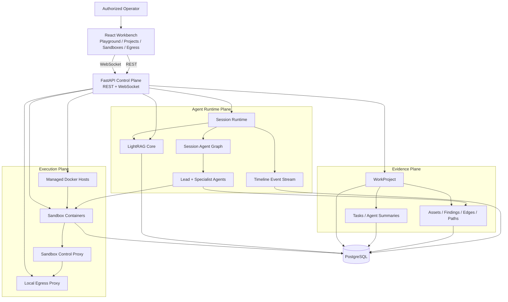
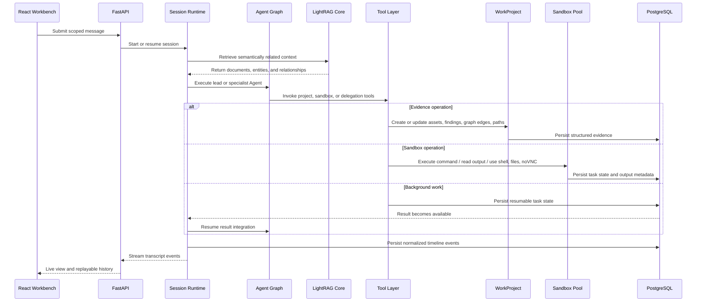
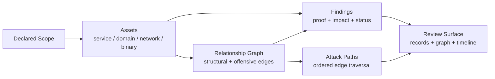
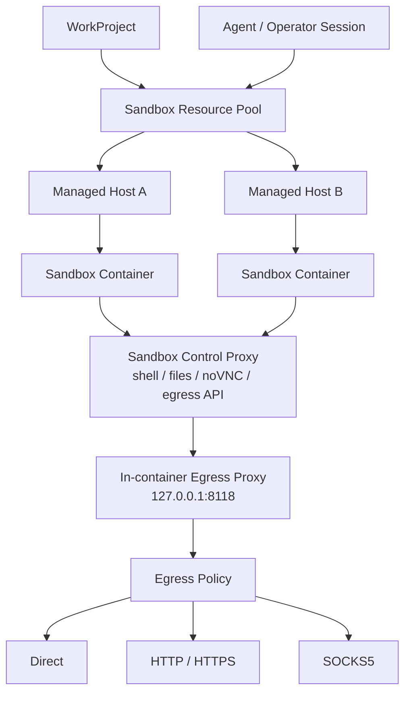

<p align="center">
  
</p>

<p align="center">
  <strong>English</strong> ·
  <a href="README_zh.md">中文</a>
</p>

<p align="center">
  <a href="#architecture">Architecture</a> ·
  <a href="#runtime-flow">Runtime Flow</a> ·
  <a href="#evidence-model">Evidence Model</a> ·
  <a href="#sandbox-and-egress">Sandbox and Egress</a> ·
  <a href="https://yv1ing.github.io/Z3r0/en/">Documentation</a> ·
  <a href="https://yv1ing.github.io/Z3r0/en/guide/quick-start">Quick Start</a>
</p>

<p align="center">
  <strong>Open-source red team collaboration workbench for authorized penetration testing, vulnerability discovery, code auditing, and security research.</strong>
</p>

---

> :warning: **Security Notice**
>
> This project is intended only for security testing, risk assessment, and academic research within legal and explicitly authorized scopes. It must not be used for unlawful, unauthorized, or destructive purposes.
>
> This project does not grant permission to test, access, scan, or affect any third-party systems, networks, services, accounts, or data.
>
> **The author is not responsible for any consequences, losses, damages, legal liabilities, or unlawful behavior caused by users.**

## Overview

Z3r0 is a control-plane-oriented red team workbench. It combines a React operator console, a FastAPI management plane, a session-based multi-Agent runtime, project-scoped evidence records, distributed Docker sandbox resources, and a controlled egress layer.

The design goal is to make Agent-assisted security work operationally bounded and reviewable. Conversations are not treated as the only source of truth. Project scope, assets, findings, relationship graph edges, attack paths, sandbox resources, egress policy, and replayable timeline events are represented as explicit application data.

## Architecture



Z3r0 separates the system into four architectural planes:

| Plane | Scope |
| --- | --- |
| Control plane | Users, system configuration, Agents, sessions, WorkProjects, Knowledges, managed hosts, sandbox images, sandbox containers, and egress proxies. |
| Runtime plane | Multi-Agent session execution, task-input LightRAG retrieval, live event streaming, long-running task continuity, history projection, and timeline replay. |
| Evidence plane | Project scope, assets, findings, relationship graph, attack paths, task progress, and per-Agent summaries. |
| Execution plane | Docker hosts, sandbox containers, shell/file/noVNC access, command execution, sandbox-local skills, built-in security tooling, and outbound network policy. |

This separation is reflected in the repository structure: routers and handlers expose application contracts, services own domain behavior, models define persistent state, and the React workbench consumes the stable REST/WebSocket surface.

## Runtime Flow




## Evidence Model



WorkProject is the durable evidence boundary for professional review. Assets are graph nodes. Relationships describe architecture or attack progression. Findings attach proof and impact to affected assets and, when needed, to a specific relationship. Attack paths are ordered traversals through the graph.

| Data object | Role in the assessment |
| --- | --- |
| WorkProject | Assessment container for owners, type, status, scope assets, sandbox bindings, sessions, tasks, and summaries. |
| Asset | Normalized target or discovered object: service, domain, network, or binary. |
| Finding | Security observation with severity, status, proof, impact, and optional graph binding. |
| Graph edge | Directed relationship between two assets, either structural or offensive. |
| Attack path | Ordered path over graph edges, used to reconstruct access or impact progression. |

The evidence model stores durable facts as queryable, visualizable, and reviewable application records while Agent summaries provide concise operational context.

## Sandbox and Egress



Sandbox resources are managed infrastructure. Administrators manage Docker hosts, sandbox images, running containers, exposed ports, and project bindings. Operators and Agents work through selected running containers, and the same sandbox boundary supports command execution, Shell sessions, file management, browser/noVNC review, and sandbox-local skills.

The default sandbox image provides a preloaded security workspace. It includes reconnaissance and DNS tools (`subfinder`, `amass`, `dnsx`, `dig`, `whois`), HTTP probing and web discovery tools (`httpx`, `ffuf`, `gobuster`, `observer_ward`, `sqlmap`, `nmap`), bounded credential-testing support (`hydra`), Android and firmware analysis tools (`jadx`, `apktool`, `Ghidra`, `binwalk`), binary and pwn tooling (`gdb`, Pwndbg, `strace`, `ltrace`, `pwntools`, and the `pwntools`-provided `checksec`), browser automation through `agent-browser-cli`, and a built-in SecLists wordlist corpus. Python workflows use `uv` for managed task environments, one-off runs, and persistent Python CLIs.

Outbound traffic is normalized through a container-level egress profile. The sandbox runtime exports proxy environment variables to a local proxy inside the container; the control plane can update the upstream policy to direct access or a managed HTTP, HTTPS, or SOCKS5 proxy. This gives the platform a unified place to manage network identity, traffic routing, and operator-environment isolation.

## Technical Highlights

| Highlight | Description |
| --- | --- |
| Multi-Agent orchestration | A lead Agent coordinates specialist Agents for intelligence gathering, validation, code audit, reverse analysis, and cryptanalysis. |
| Project evidence plane | WorkProject turns transient investigation output into persistent records, graph relationships, paths, tasks, and summaries. |
| Retrieval context plane | Building knowledge graphs with LightRAG Core provides matching original document chunks and graph context for task-oriented inputs. |
| Replayable event timeline | The UI consumes normalized timeline events that can be streamed live or loaded later as history. |
| Distributed sandbox resources | Managed Docker hosts, images, and containers allow execution environments to be isolated, scaled, and assigned to projects. |
| Preloaded sandbox toolchain | The default sandbox image bundles recon, DNS, web discovery, credential testing, Android, firmware, reverse engineering, browser, Python, and wordlist capabilities behind sandbox-local skills. |
| Unified egress layer | Container traffic can be routed through direct, HTTP, HTTPS, or SOCKS5 modes using one platform-managed policy surface. |
| Operator workbench | The frontend combines chat, project records, graph review, sandbox selector, terminal, files, and noVNC into one workflow. |

## Expert Team

| Code | Name | Role | Responsibilities |
| --- | --- | --- | --- |
| `cso` | Z3r0 | Chief Security Lead | Task decomposition, team coordination, result integration |
| `cae` | V3ra | Code Audit Engineer | Source code auditing, dependency review, remediation verification |
| `cie` | L1ly | Intelligence Gathering Engineer | Intelligence gathering, asset discovery, relationship mapping |
| `cpe` | Fr4nk | Penetration Testing Engineer | Penetration testing, vulnerability validation, impact confirmation |
| `cre` | J4m3 | Reverse Analysis Engineer | Reverse analysis, firmware disassembly, binary unpacking |
| `cce` | Nu1L | Cryptography Engineer | Cryptographic analysis, key review, security assessment |

## Repository Layout

```text
core/        Agent specs, runtime, task runtime, delegation, context, tools
service/     Domain services for Agent, knowledge, sandbox, users, hosts, egress, projects
router/      FastAPI route declarations
handler/     HTTP and WebSocket request handling
model/       SQLModel database models
schema/      Pydantic API contracts
web/         React workbench and landing page
sandbox/     Docker sandbox image and control proxy
docs/        VitePress documentation
.z3r0/       Runtime configuration, Agent prompts, logs
.lightrag/   Temporary LightRAG parser inputs and local working files
```

## Documentation

- [Overview](https://yv1ing.github.io/Z3r0/en/guide/overview)
- [Quick Start](https://yv1ing.github.io/Z3r0/en/guide/quick-start)
- [First Use](https://yv1ing.github.io/Z3r0/en/guide/first-use)
- [Community](https://yv1ing.github.io/Z3r0/en/guide/community)

## Acknowledgments

Thanks to the [Linux.do](https://linux.do/) website and its community for their support in project development and communication.

## License

This project is licensed under the [MIT License](LICENSE).
