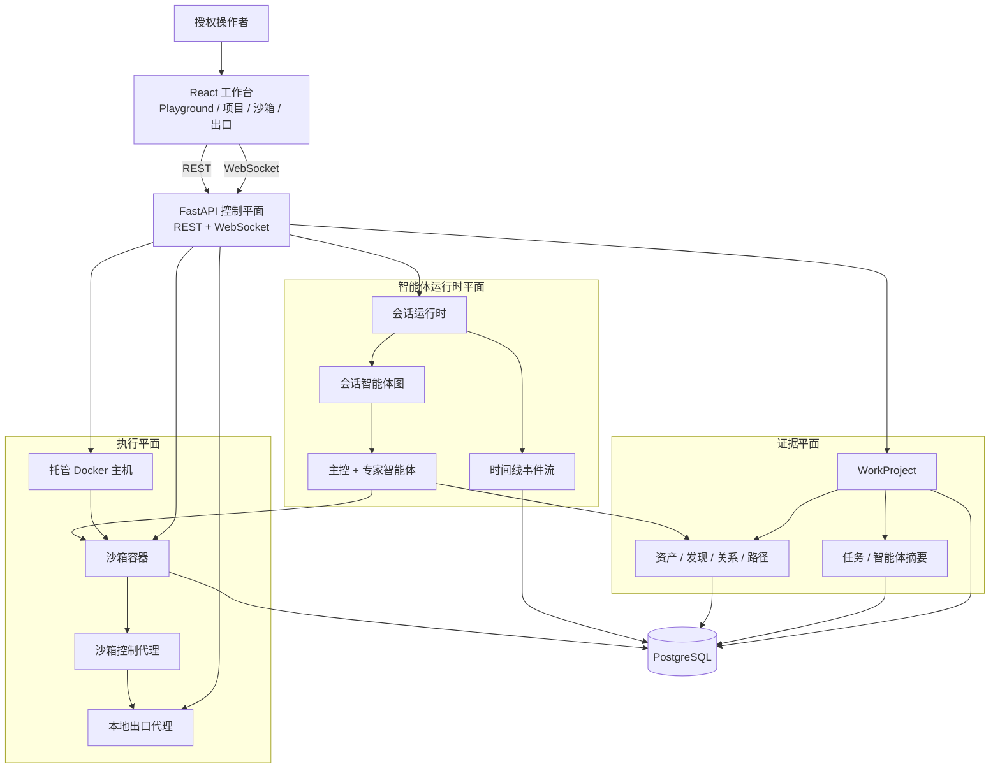
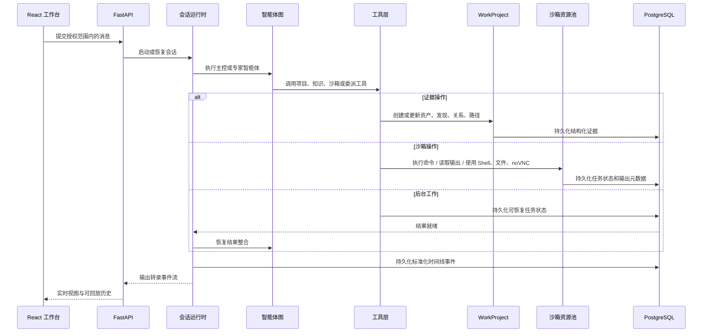
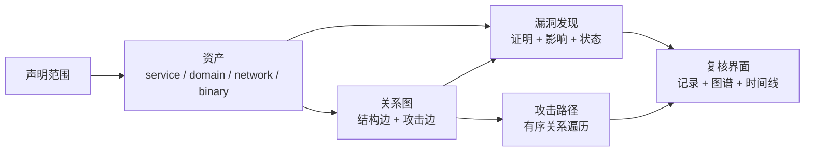
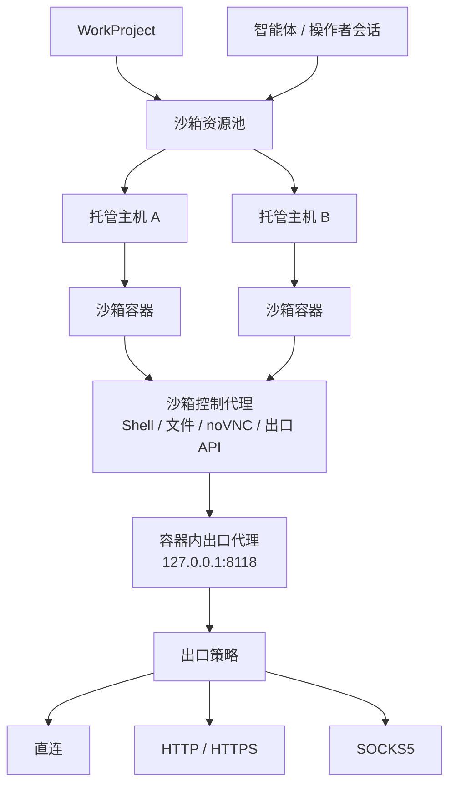

<p align="center">
  
</p>

<p align="center">
  <a href="README.md">English</a> ·
  <strong>中文</strong>
</p>

<p align="center">
  <a href="#总体架构">总体架构</a> ·
  <a href="#运行链路">运行链路</a> ·
  <a href="#证据模型">证据模型</a> ·
  <a href="#沙箱与出口">沙箱与出口</a> ·
  <a href="https://yv1ing.github.io/Z3r0/zh/">文档</a> ·
  <a href="https://yv1ing.github.io/Z3r0/zh/guide/quick-start">快速开始</a>
</p>

<p align="center">
  <strong>面向授权渗透测试、漏洞挖掘、代码审计与安全研究的开源红队协作工作台。</strong>
</p>

---

> :warning: **安全声明**
>
> 本项目仅限在合法且获得明确授权的范围内用于安全测试、风险评估和学术研究，严禁用于任何违法、未授权或具有破坏性的用途。
>
> 本项目不授予任何测试、访问、扫描或影响第三方系统、网络、服务、账号或数据的权限。
>
> **作者不对使用者造成的任何后果、损失、损害、法律责任或违法行为负责。**

## 概览

Z3r0 是面向红队协作的控制平面型工作台。它将 React 操作台、FastAPI 管理平面、会话级多智能体运行时、项目级证据记录、分布式 Docker 沙箱资源和受控出口层组合在一起。

Z3r0 的设计目标是让智能体辅助的安全工作具备清晰边界和可复核性。对话不是唯一事实来源；项目范围、资产、漏洞发现、关系图、攻击路径、沙箱资源、出口策略和可回放时间线都作为显式应用数据管理。

## 总体架构



Z3r0 将系统划分为四个架构平面：

| 平面 | 范围 |
| --- | --- |
| 控制平面 | 用户、系统配置、智能体、会话、WorkProject、托管主机、沙箱镜像、沙箱容器和出口代理。 |
| 运行时平面 | 多智能体会话执行、实时事件流、长周期任务连续性、历史投影和时间线回放。 |
| 证据平面 | 项目范围、资产、漏洞发现、关系图、攻击路径、任务进度和智能体摘要。 |
| 执行平面 | Docker 主机、沙箱容器、Shell/文件/noVNC 访问、命令执行、沙箱内 skills、内置安全工具集和出站网络策略。 |

这种划分也体现在代码结构中：router 与 handler 暴露应用契约，service 承载领域行为，model 定义持久状态，React 工作台消费稳定的 REST/WebSocket 接口。

## 运行链路



运行时面向长周期评估设计。前端可以实时消费事件流、加载已持久化的时间线分页、切换会话、查看子任务工作并打开项目记录，而不依赖模型供应商的原始事件格式。长命令和专家任务被表达为应用状态，因此结果可以在完成后再进入所属会话整合，而不是迫使操作者停留在阻塞式 turn 中等待。

## 证据模型



WorkProject 是专业复核的持久证据边界。资产是图节点；关系描述目标架构或攻击推进；漏洞发现将证明与影响绑定到受影响资产，并在需要时绑定到具体关系；攻击路径则是关系图上的有序遍历。

| 数据对象 | 在评估中的角色 |
| --- | --- |
| WorkProject | 评估容器，包含负责人、类型、状态、范围资产、沙箱绑定、会话、任务和摘要。 |
| 资产 | 标准化目标或发现对象：服务、域名、网络或二进制文件。 |
| 漏洞发现 | 带有严重性、状态、证明、影响和可选图绑定的安全观察。 |
| 关系边 | 两个资产之间的有向关系，可描述结构关系或攻击推进。 |
| 攻击路径 | 基于关系边的有序路径，用于还原访问或影响推进过程。 |

该模型让证据独立于模型上下文。智能体摘要可以保持精简，而持久事实仍然可查询、可视化、可复核。

## 沙箱与出口



沙箱不是附属工具调用，而是受管理的基础设施。管理员可以管理 Docker 主机、沙箱镜像、运行容器、端口映射和项目绑定。操作者与智能体通过选定的运行中容器工作，同一沙箱边界承载命令执行、Shell 会话、文件管理、浏览器/noVNC 复核和沙箱内 skills。

默认 sandbox 镜像不是裸 Shell，而是预装的安全工作空间。它包含侦察与 DNS 工具（`subfinder`、`amass`、`dnsx`、`dig`、`whois`）、HTTP 探测与 Web 发现工具（`httpx`、`ffuf`、`gobuster`、`observer_ward`、`sqlmap`、`nmap`）、受控凭据测试能力（`hydra`）、Android 与固件分析工具（`jadx`、`apktool`、`Ghidra`、`binwalk`）、二进制与 pwn 工具链（`gdb`、Pwndbg、`strace`、`ltrace`、`pwntools` 以及由 `pwntools` 提供的 `checksec`）、通过 `agent-browser-cli` 支持的浏览器自动化能力，以及内置 SecLists 字典语料。Python 工具链以 `uv` 为默认路径，任务虚拟环境、一次性 Python 运行和持久 Python CLI 都应显式选择解释器，避免随意使用全局 `pip` 安装。

出站流量通过容器级出口配置归一化。沙箱运行时将代理环境变量指向容器内本地代理，控制平面可以将上游策略更新为直连或托管的 HTTP、HTTPS、SOCKS5 代理。该设计为网络身份、流量路由和操作者环境隔离提供统一策略面。

## 技术亮点

| 亮点 | 说明 |
| --- | --- |
| 多智能体编排 | 主控智能体协调情报搜集、漏洞验证、代码审计、逆向分析和密码分析专家。 |
| 项目证据平面 | WorkProject 将临时分析输出转化为持久记录、关系图、攻击路径、任务和摘要。 |
| 可回放事件时间线 | 前端消费标准化时间线事件，同一模型支持实时流和历史回放。 |
| 分布式沙箱资源 | 托管 Docker 主机、镜像和容器使执行环境可以隔离、扩展并绑定到项目。 |
| 预装 sandbox 工具链 | 默认 sandbox 镜像围绕 sandbox 内 skills 提供侦察、DNS、Web 发现、凭据测试、Android、固件、逆向、浏览器、Python 和字典能力。 |
| 统一出口层 | 容器流量可通过直连、HTTP、HTTPS 或 SOCKS5 模式路由，并由平台统一管理策略。 |
| 操作者工作台 | 前端将对话、项目记录、图谱复核、沙箱选择、终端、文件和 noVNC 组织为统一流程。 |

## 专家团队

| 代码 | 名称 | 角色 | 职责 |
| --- | --- | --- | --- |
| `cso` | Z3r0 | 首席安全负责人 | 任务拆解、团队协调、结果整合 |
| `cae` | V3ra | 代码审计工程师 | 源码审计、依赖审查、修复复核 |
| `cie` | L1ly | 情报搜集工程师 | 情报搜集、资产发现、关系映射 |
| `cpe` | Fr4nk | 渗透测试工程师 | 渗透测试、漏洞验证、影响确认 |
| `cre` | J4m3 | 逆向分析工程师 | 逆向分析、固件拆解、程序解包 |
| `cce` | Nu1L | 密码分析工程师 | 密码分析、密钥审查、安全评估 |

## 代码结构

```text
core/        Agent 规格、运行时、任务运行时、委派、上下文、工具
service/     Agent、沙箱、用户、主机、代理出口、项目等领域服务
router/      FastAPI 路由声明
handler/     HTTP/WebSocket 请求处理
model/       SQLModel 数据库模型
schema/      Pydantic API 契约
web/         React 工作台与 landing 页
sandbox/     Docker 沙箱镜像与控制代理
docs/        VitePress 文档
.z3r0/       运行配置、智能体提示词、知识文件和日志
```

## 文档

- [概览](https://yv1ing.github.io/Z3r0/zh/guide/overview)
- [快速开始](https://yv1ing.github.io/Z3r0/zh/guide/quick-start)
- [首次使用](https://yv1ing.github.io/Z3r0/zh/guide/first-use)
- [组建社群](https://yv1ing.github.io/Z3r0/zh/guide/community)

## 致谢

感谢 [Linux.do](https://linux.do/) 站点及其社区为项目开发和交流提供支持。

## License

本项目基于 [MIT License](LICENSE) 开源。
