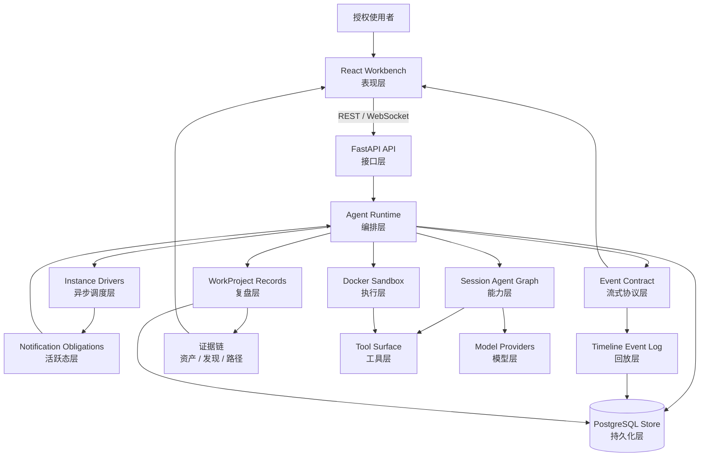
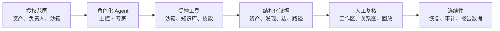
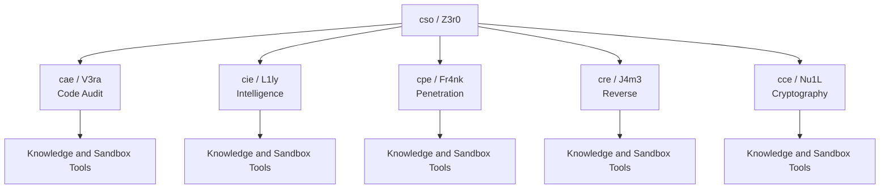
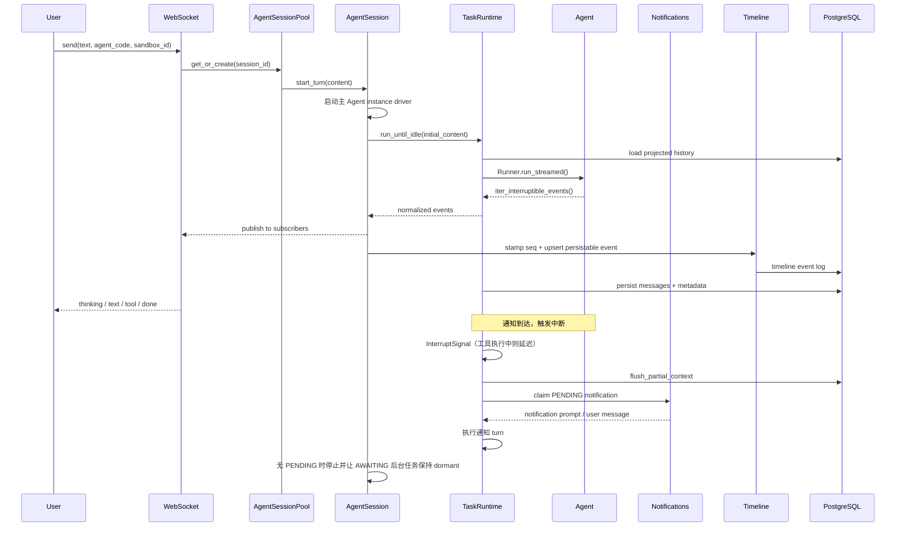
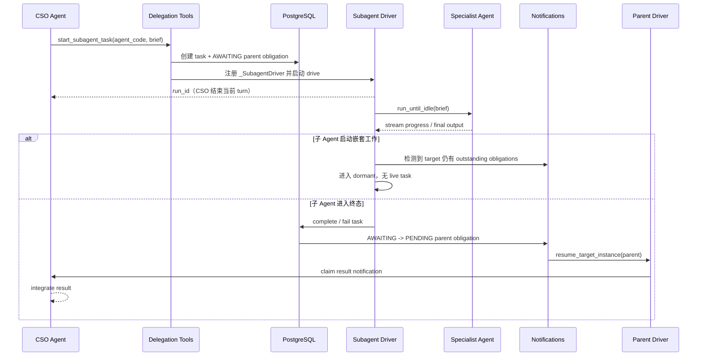
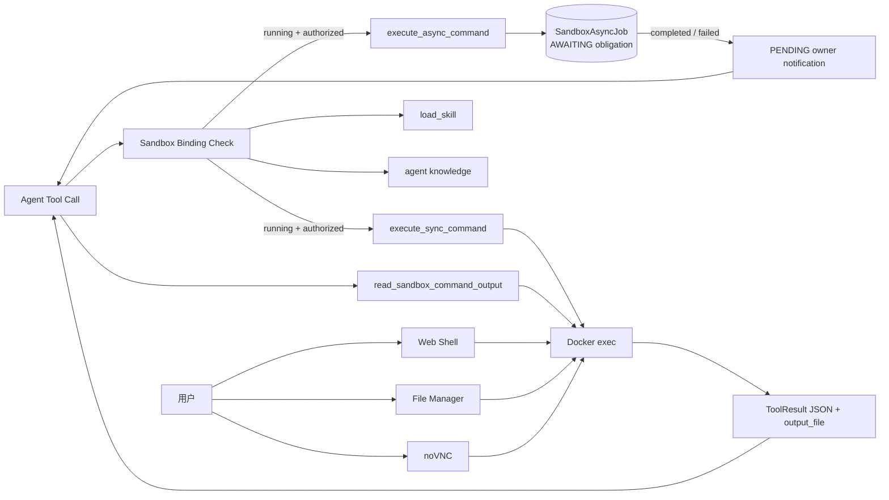
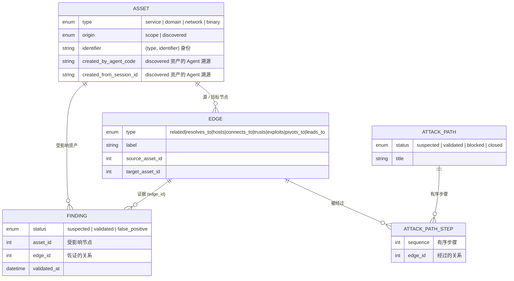

<p align="center">
  
</p>

<p align="center">
  <a href="README.md">English</a> ·
  <strong>中文</strong>
</p>

<p align="center">
  <a href="#总体架构">总体架构</a> ·
  <a href="#agent-编队">Agent 编队</a> ·
  <a href="#运行模型">运行模型</a> ·
  <a href="#部署运行">部署运行</a> ·
  <a href="QUICKSTART_zh.md">快速开始</a>
</p>

---

> :warning: **法律声明**
>
> **本项目仅限在合法且明确授权的范围内用于安全测试、评估与研究，严禁用于任何未授权、违法或有害用途。作者不对使用者造成的任何后果、损失、损害、法律责任或违法行为负责。**
>
> 本项目仅面向已授权的安全评估、代码审计、内部复核和受控研究场景。本项目本身不授予任何测试、访问、扫描或影响第三方系统、网络、服务、账号或数据的权限。使用者应自行取得并保存授权，明确使用范围，并遵守适用法律法规、合同约定和授权边界。

Z3r0 是一个面向授权环境的 AI 原生安全评估工作台。平台将主控 Agent、专业 Agent、Docker 执行边界、持久证据记录和可回放时间线组合在一起，使计划制定、资产发现、风险验证、关系梳理、攻击路径还原和人工复核保持在同一个受控工作流中。

项目的核心运行前提是：Agent 可以辅助分析与执行，但可复核事实必须以结构化、带范围、可审计、可回放的形式保存在模型上下文之外。WorkProject 记录将资产、发现、关系边和攻击路径作为应用自有数据持久化；运行时则通过通知义务恢复长周期 Agent 工作，避免轮询循环和阻塞式 driver。

## 设计原则

- **先授权，后自动化**：所有工作流都以明确合法范围、受控目标和操作者责任为前提。
- **角色化执行**：主控 Agent 负责任务拆解和结果整合，专业 Agent 在职责边界内处理情报、渗透验证、代码审计、逆向分析和密码学审查。
- **结构化证据优先**：资产、发现、关系边和攻击路径保存在模型上下文之外，确保对话变化后证据仍可复核。
- **长周期任务可恢复**：通知义务统一表达子 Agent 工作和沙箱异步任务，使 driver 可以干净停止，并在结果可集成时恢复。
- **受控执行边界**：命令、浏览器、文件管理、图形工具和技能均通过绑定的 Docker 沙箱执行，而不是直接运行在应用宿主机上。
- **稳定契约**：前端消费 REST、WebSocket、时间线和生成 schema 契约，不直接依赖模型 SDK 或服务商内部事件。

## 总体架构



系统按明确层次组织：面向使用者的工作台、API 边界、运行时编排、可恢复的 instance driver、通知驱动的活跃态、会话级 Agent Graph、受控执行、模型访问、流式事件协议、持久化时间线回放和 WorkProject 证据记录。后端负责认证、会话生命周期、上下文投影、事件归一化、任务委派、沙箱绑定、工具挂载、通知义务、项目内记录、持久化和历史压缩；前端消费稳定的 REST 与 WebSocket 协议，不直接依赖模型 SDK 或模型服务商细节。

### 价值链路



这条价值链使高风险安全工作保持清晰边界：先声明范围，再由 Agent 通过显式工具执行；工具输出被沉淀为结构化记录；复核人员可以基于图谱和时间线检查结果，而不依赖隐藏的模型状态。

## Agent 编队

| Code | Name | Role | 主要职责 |
| --- | --- | --- | --- |
| `cso` | Z3r0 | Chief Security Officer | 任务拆解、团队协调、结果整合 |
| `cae` | V3ra | Chief Audit Engineer | 代码审计、依赖审查、修复复核 |
| `cie` | L1ly | Chief Intelligence Engineer | 情报收集、资产梳理、关系分析 |
| `cpe` | Fr4nk | Chief Penetration Engineer | 渗透测试、漏洞验证、风险确认 |
| `cre` | J4m3 | Chief Reverse Engineer | 文件、二进制、固件、APK 逆向 |
| `cce` | Nu1L | Chief Cryptography Engineer | 密码协议、密钥管理、实现审查 |



Agent 能力按会话动态装配。`AgentRegistry` 基于配置、角色规格、知识生成结果、当前沙箱绑定和 WorkProject 绑定创建会话级 Agent Graph；只有当会话绑定了已授权且运行中的沙箱时，命令类工具才会挂载。WorkProject 记录工具只在项目会话中挂载，普通 chat 会话不会获得资产、发现、关系边或攻击路径能力。

## 运行模型



关键运行边界：

- **非阻塞 instance driver**：`AgentSession._drive` 和 `_SubagentDriver` 执行可选初始 turn、drain 当前可领取的通知，然后进入 settle。后台工作仍处于 `AWAITING` 时 driver 会停止；完成通知会在结果可集成时重新启动 owner 的主 Agent 或子 Agent instance。
- **中断驱动的任务运行时**：`run_until_idle` 管理 Agent turn 的完整生命周期；`iter_interruptible_events` 将 SDK 事件流与通知信号竞赛，在安全点（待处理工具调用完成后）抛出 `InterruptSignal`，参考 CPU 中断屏蔽机制保证同步工具的原子性。
- **通知表作为活跃态来源**：`AgentNotification` 行是活动工作的单一事实来源。`AWAITING` 表示后台义务仍在运行，`PENDING` 唤醒 owner Agent，`PROCESSING` 表示通知 turn 已被领取。
- **异步命令 turn-terminal**：`execute_async_command` 派发沙箱命令后只返回 `status` 和 `run_id`，`AgentRegistry` 通过 `tool_use_behavior` 立即结束当前 turn。命令完成后运行时自动恢复 Agent；没有轮询或列表等待循环。
- **时间线事件日志**：实时事件由 `TimelineLogWriter` 打上稳定 `seq` 和 item key；可持久化事件被 upsert 到 durable event log，回放直接读取同一套前端 wire event，而不是从 SDK message 重新推导 UI 状态。
- **事件归一化**：模型和 Agent SDK 的原始事件被转换为稳定的 `thinking_delta`、`text_delta`、`tool_call`、`tool_result`、`subagent_task` 等前端事件。
- **会话池**：`AgentSessionPool` 维护活跃会话、通知恢复、中断、取消、空闲回收和工具绑定失效。
- **历史投影**：`Z3r0Session` 在 SDK 消息外补充 owner、nested call 等元数据，使不同 Agent 获得适合自身角色的共享上下文视图。
- **上下文压缩**：当上下文接近模型窗口时，运行时会摘要更早的投影历史，同时保留近期上下文和关键事实。

## 委派链路



专业 Agent 通过可恢复的 per-run `_SubagentDriver` 运行。启动子 Agent 时，`AgentSubordinateTask` 记录和父 Agent 的 `SUBAGENT_FINISHED` 通知义务在同一个数据库事务中创建，因此父 Agent 不会观察到“子任务既不在运行、也没有待集成通知”的空窗。每个 subagent driver 使用与主 Agent 相同的 `run_until_idle` 执行器，通过会话事件总线输出嵌套事件，并在 drain 后进入三种状态之一：如果 drain 期间又出现可领取通知则 relaunch；如果仍有子任务或异步命令未完成则 dormant；否则 complete、fail 或 cancel 当前任务。

当子 Agent 完成或失败时，任务终态更新和父通知义务的 `AWAITING` -> `PENDING` 转换在同一事务中提交。`resume_target_instance` 唤醒 owner driver：主 Agent target 通过 `AgentSessionPool.resume_session` 恢复，子 Agent target 则重新启动对应 dormant `_SubagentDriver`。被取消的子任务会静默解析义务，不唤醒父 Agent。

## 沙箱工具



可选沙箱镜像可包含浏览器、noVNC、逆向分析工具、网络评估工具和相关复核工具。同步命令会立即返回捕获输出的元数据。异步命令被明确设计为 turn-terminal：派发后 Agent 停止，只有在任务完成或失败后才由通知恢复，并通过 owner notification 提供终态、退出码、输出大小和输出文件。Agent 使用 `read_sandbox_command_output` 读取已完成输出，不轮询运行中的任务。

## WorkProject 记录

WorkProject 会话是持久化评估工作区。结构化记录保存在应用自有表中，不进入模型上下文，也不修改 SDK 内部表：

- **资产**：关系图中唯一的节点。`type` 为 `service`、`domain`、`network`、`binary` 之一；`service`/`domain`/`network` 使用 `host` 字段（`service` 的 `port` 可选），`binary` 使用 `path`，精简的 `extra` 对象只存一条简短的侦察 `banner`；`origin` 标记资产是声明的范围目标（`scope`）还是 Agent 新发现的（`discovered`）。每条资产以归一化的 `(type, identifier)` 身份唯一区分。
- **发现**：疑似、已验证或误报的风险。发现记录所属资产，并在 `description`/`impact` 中自带佐证；当它佐证某条关系或攻击步骤时，挂到对应的关系边上。
- **关系图**：连接两个资产的有向边。`type` 分两类——结构类（`related`、`resolves_to`、`hosts`、`connects_to`、`trusts`）描绘目标架构，攻击类（`exploits`、`pivots_to`、`leads_to`）描绘攻击推进；挂在某条边上的发现即为该关系的佐证。
- **攻击路径**：有序链路，每个步骤经过一条关系边，用于还原访问或影响的推进过程。

这些记录通过 WorkProject 作用域 REST API 与项目会话 UI 只读展示，由 Agent 在会话绑定 WorkProject 时通过会话工具创建和更新；普通 chat 会话不会获得相关工具或前端入口。Agent summary 只保留紧凑检查点，持久事实保存在结构化项目记录中。报告生成仍是后续路线，不属于当前实现范围。

### 可审计的攻击链路

四类记录构成同一张图：资产是节点，边是节点之间的有向关系，发现是挂在节点和/或边上的证据，攻击路径则是边上的有序游走。边的结构/攻击分类由其 `type` 派生（并非存储列）。由于每一条论断都锚定在它所描述的图元素上，整个评估过程得以端到端可追溯。



该链路从五个维度实现可审计、可追溯：

- **溯源**：由 Agent 创建的资产、边、发现、路径、步骤携带 `created_by_agent_code`、`created_from_session_id` 与 `created_at`/`updated_at`，可回溯到具体是哪个 Agent、哪个会话、在何时产生。声明的 `scope` 资产由项目元数据拥有，运行时溯源保持为空。
- **证据绑定**：发现的 `edge_id` 把佐证绑定到某条具体关系，`asset_id` 把佐证绑定到某个具体节点，佐证本身（`description`/`impact`）保存在发现里——因此任一关系或攻击步骤都能下钻到支撑它的证据。
- **置信度生命周期**：发现的 `status`（`suspected` → `validated`/`false_positive`，验证时刻由 `validated_at` 打戳）与攻击路径的 `status`（`suspected` → `validated`，或 `blocked`/`closed`）共同让每条论断的成熟度显式可见；未经验证的内容不会被当作事实呈现。
- **可重放路径**：攻击路径是有序步骤列表，每步锚定两资产间的一条边，因此从入口到影响的路线可逐跳重建，且每一跳都携带各自的支撑发现。
- **范围问责与一致性**：`origin` 区分声明的 `scope` 与 Agent 扩展的 `discovered` 面，便于对照委托边界核查工作；引用规则保持图一致（删资产会清除其边并解绑其发现，删边会移除经过它的步骤并解绑其发现），审计轨迹不会残留悬挂引用。

## 技术特性

- **真正异步的 instance driver**：主 Agent 和子 Agent driver 都只 drain ready turn 后停止，不阻塞等待后台子任务或长时间沙箱命令；完成通知会在集成工作可执行时重新启动 owner instance。
- **中断驱动的任务运行时**：`run_until_idle` 为主/子 Agent 提供统一的执行循环；`iter_interruptible_events` 将 SDK 事件流与通知信号竞赛，以 CPU 中断屏蔽式的原子性在待处理工具调用完成后抛出 `InterruptSignal`，实现抢占式通知处理。
- **通知义务调度器**：子 Agent 任务和沙箱异步命令会与自身记录原子地注册 `AWAITING` obligation；终态更新再把 obligation 切换为 `PENDING`、`COMPLETED`、`FAILED` 或 `CANCELED`，会话活跃态只需读取通知表。
- **异步命令 turn-terminal dispatch**：成功的 `execute_async_command` 调用会通过 SDK tool-use behavior 立即结束 Agent turn，阻止后续轮询，并使完成通知成为唯一恢复路径。
- **会话级 Agent Graph**：角色配置、工具、知识库和子 Agent 按会话状态动态绑定。
- **自愈式委派 driver**：子 Agent 可在 live 或 dormant 状态取消；后端重启后陈旧运行任务会被标记失败；relaunch budget 避免无法推进时形成热循环。
- **持久化时间线回放**：UI 时间线以单调递增 `seq` 和 item key 持久化稳定事件 payload，刷新/回放使用与实时流相同的事件契约。
- **多视角上下文投影**：不同 Agent 共享同一份持久化历史，但只接收符合自身角色的上下文视图，降低工具私有信息互相污染的风险。
- **长上下文压缩**：基于模型窗口生成摘要，保留长周期复核中的关键事实和近期状态。
- **稳定流式协议**：前端与模型 SDK 解耦，只消费应用级事件模型。
- **沙箱工具失效控制**：沙箱状态变化会触发工具绑定失效，并清理运行中的子任务或异步命令。
- **项目级安全记录**：资产、发现、关系图边和攻击路径均作为应用自有 WorkProject 记录持久化，并通过稳定 API 契约回放。

## 代码结构

```text
core/        Agent 规格、运行时、任务运行时、委派、上下文、工具
service/     业务服务：Agent、沙箱、用户、工作项目
router/      FastAPI 路由定义
handler/     HTTP/WebSocket 请求处理
model/       SQLModel 数据模型
schema/      Pydantic API 契约
web/         React 前端工作台
sandbox/     可选 Docker 沙箱镜像
.z3r0/       运行配置、Agent 角色提示词、日志
```

## 部署运行

完整部署步骤见 [QUICKSTART_zh.md](QUICKSTART_zh.md)。

```bash
cp .z3r0/config.json.example .z3r0/config.json
# 检查数据库、初始管理员、模型服务和沙箱相关配置
docker compose -f docker-compose.prod.yml up -d --build
```

访问 `http://127.0.0.1:8000`。

## 安全边界

Z3r0 仅面向合法授权的安全评估、代码审计、内部复核和研究教学场景。本项目不授权访问任何第三方目标，不得用于未授权或违法活动。沙箱容器、Docker socket、终端、文件管理器和模型密钥均属于高权限资产，应仅在可信、隔离的环境中使用。

使用者在调用任何工具能力前，应先明确并遵守授权范围。作者不对使用者行为造成的任何后果、损失、损害、法律责任或违法行为负责。

## 致谢

感谢[Linux.do](https://linux.do/)站点及其社区为项目开发和交流提供支持。

## License

本项目基于 [MIT License](LICENSE) 开源。
