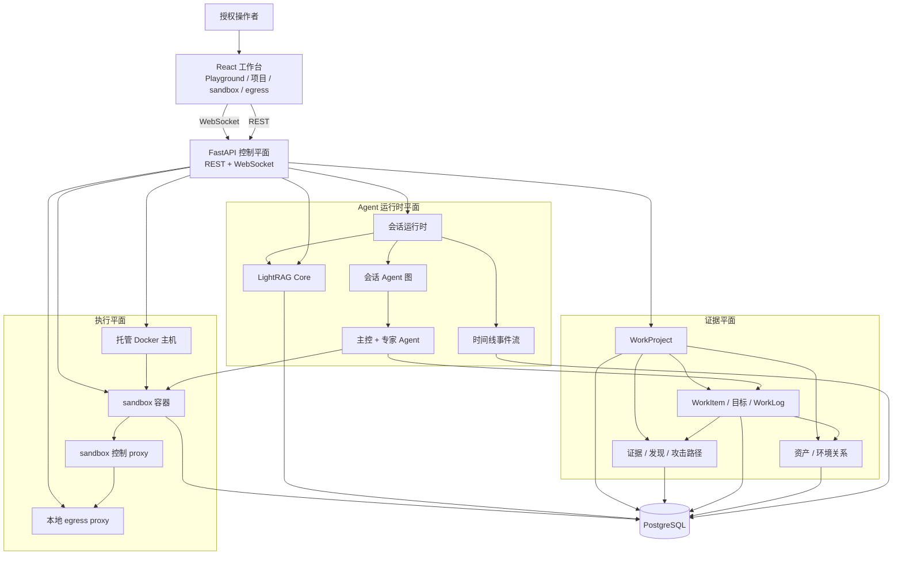
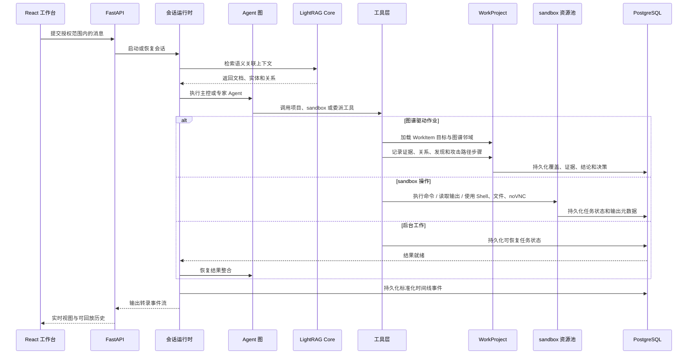
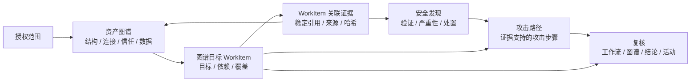
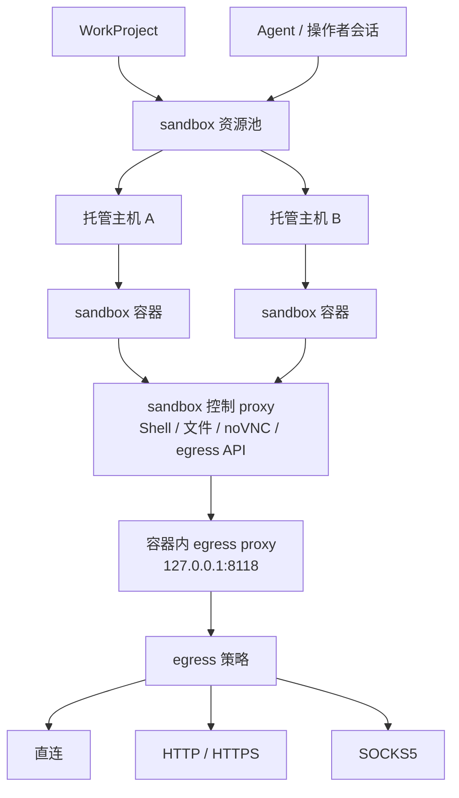

<p align="center">
  
</p>

<p align="center">
  <a href="README.md">English</a> ·
  <strong>中文</strong>
</p>

<p align="center">
  <a href="#总体架构">总体架构</a> ·
  <a href="#运行链路">运行链路</a> ·
  <a href="#证据模型">证据模型</a> ·
  <a href="#sandbox-与-egress">sandbox 与 egress</a> ·
  <a href="https://yv1ing.github.io/Z3r0/zh/">文档</a> ·
  <a href="https://yv1ing.github.io/Z3r0/zh/guide/quick-start">快速开始</a>
</p>

<p align="center">
  <strong>面向授权渗透测试、漏洞挖掘、代码审计与安全研究的开源红队协作工作台。</strong>
</p>

---

> :warning: **安全声明**
>
> 本项目仅限在合法且获得明确授权的范围内用于安全测试、风险评估和学术研究，严禁用于任何违法、未授权或具有破坏性的用途。
>
> 本项目不授予任何测试、访问、扫描或影响第三方系统、网络、服务、账号或数据的权限。
>
> **作者不对使用者造成的任何后果、损失、损害、法律责任或违法行为负责。**

## 概览

Z3r0 是面向红队协作的控制平面型工作台。它将 React 操作台、FastAPI 管理平面、会话级多 Agent 运行时、项目级证据记录、分布式 Docker sandbox 资源和受控 egress 层组合在一起。

Z3r0 将授权范围、资产关系、专家分工、证据、漏洞发现、攻击路径、工作流决策、sandbox 资源和会话时间线汇聚到统一工作空间。红队可以在同一界面协调执行、掌握评估进展、追溯结论依据并复核完整行动过程，无需再从分散的对话和工具中还原项目状态。

## 总体架构



Z3r0 将系统划分为四个架构平面：

| 平面 | 范围 |
| --- | --- |
| 控制平面 | 用户、系统配置、Agent、会话、WorkProject、Knowledges、托管主机、sandbox 镜像、sandbox 容器和 egress proxy。 |
| 运行时平面 | 多 Agent 会话执行、任务输入的 LightRAG 检索、实时事件流、长周期任务连续性、历史投影和时间线回放。 |
| 证据平面 | 授权范围、资产关系、图谱目标 WorkItem、不可变证据、漏洞发现、攻击路径、目标覆盖和工作流决策。 |
| 执行平面 | Docker 主机、sandbox 容器、Shell/文件/noVNC 访问、命令执行、sandbox 内 skills、内置安全工具集和 egress 策略。 |

这种划分也体现在代码结构中：router 与 handler 暴露应用契约，service 承载领域行为，model 定义持久状态，React 工作台消费稳定的 REST/WebSocket 接口。

## 运行链路




## 证据模型



WorkProject 为每次评估提供持久、完整的协作空间。操作者可以通过资产图谱理解目标环境，将专家分工落实到具体资产和测试面，复核每项工作的证据，并沿攻击路径跟踪已经验证的攻击推进。Finding 与路径结论持续关联其支撑材料，使团队能够从初始范围一路追溯到复核与重测结果。

| 数据对象 | 在评估中的角色 |
| --- | --- |
| WorkProject | 负责人、授权范围、sandbox 绑定、会话、工作流和结项的评估边界。 |
| Asset | 采用规范 locator 标识的网络、主机、域名、服务、应用、端点、代码、制品、身份、数据或云实体。 |
| Relation | 描述结构、连接、依赖、身份、信任、数据流和来源的证据成熟环境断言。 |
| WorkItem | 将受派专家与图谱目标、依赖、测试面、完成标准、证据、覆盖结论和主控复核关联起来的协同行动单元。 |
| Evidence | 归属于 WorkItem 的不可变观察事实，具备来源、稳定原始材料引用、替代链和受保护的失效处理。 |
| Finding | 包含验证、影响、处置状态和证据支持严重性的安全结论；使用 CVSS 时严重性与评分保持一致。 |
| AttackPath | 从入口到目标的连续攻击动作序列，每个步骤可绑定证据与 ATT&CK 映射。 |

工作台集中呈现范围覆盖、当前分工、受阻测试面、待复核工作、已验证 Finding、AttackPath、Evidence 和专家活动。主控可以复核已完成工作，将指定目标面退回进一步验证，并通过搜索和筛选从项目整体态势快速定位到相关资产、分工、证据链或安全结论。

## Sandbox 与 egress



Sandbox 资源作为基础设施统一管理。管理员可以管理 Docker 主机、sandbox 镜像、运行容器、端口映射和项目绑定。操作者与 Agent 通过选定的运行中容器工作，同一 sandbox 边界承载命令执行、Shell 会话、文件管理、浏览器/noVNC 复核和 sandbox 内 skills。

默认 sandbox 镜像提供预装的安全工作空间。它包含侦察与 DNS 工具（`subfinder`、`amass`、`dnsx`、`dig`、`whois`）、HTTP 探测与 Web 发现工具（`httpx`、`ffuf`、`gobuster`、`observer_ward`、`sqlmap`、`nmap`）、受控凭据测试能力（`hydra`）、Android 与固件分析工具（`jadx`、`apktool`、`Ghidra`、`binwalk`）、二进制与 pwn 工具链（`gdb`、Pwndbg、`strace`、`ltrace`、`pwntools` 以及由 `pwntools` 提供的 `checksec`）、通过 `agent-browser-cli` 支持的浏览器自动化能力，以及内置 SecLists 字典语料。Python 工作流使用 `uv` 管理任务环境、一次性运行和持久 Python CLI。

出站流量通过容器级 egress 配置归一化。sandbox 运行时将 proxy 环境变量指向容器内本地 proxy，控制平面可以将上游策略更新为 Direct 或托管的 HTTP、HTTPS、SOCKS5 proxy。该设计为网络身份、流量路由和操作者环境隔离提供统一策略面。

## 技术亮点

| 亮点 | 说明 |
| --- | --- |
| 多 Agent 编排 | 主控 Agent 协调情报搜集、漏洞验证、代码审计、逆向分析和密码分析专家。 |
| 图谱驱动作业 | WorkProject 将专家 WorkItem 绑定到范围内资产、测试面、证据、发现和攻击路径验证。 |
| 检索上下文平面 | 通过 LightRAG Core 构建知识图谱，为任务型输入提供匹配的原始文档分块与图谱上下文。 |
| 可回放事件时间线 | 前端消费标准化时间线事件，同一模型支持实时流和历史回放。 |
| 分布式 sandbox 资源 | 托管 Docker 主机、镜像和容器使执行环境可以隔离、扩展并绑定到项目。 |
| 预装 sandbox 工具链 | 默认 sandbox 镜像围绕 sandbox 内 skills 提供侦察、DNS、Web 发现、凭据测试、Android、固件、逆向、浏览器、Python 和字典能力。 |
| 统一出口层 | 容器流量可通过直连、HTTP、HTTPS 或 SOCKS5 模式路由，并由平台统一管理策略。 |
| 操作者工作台 | 前端将对话、工作流状态、图谱复核、证据链、攻击路径、sandbox 选择、终端、文件和 noVNC 组织为统一流程。 |

## 专家团队

| 代码 | 名称 | 角色 | 职责 |
| --- | --- | --- | --- |
| `cso` | Z3r0 | 首席安全负责人 | 任务拆解、团队协调、结果整合 |
| `cae` | V3ra | 代码审计工程师 | 源码审计、依赖审查、修复复核 |
| `cie` | L1ly | 情报搜集工程师 | 情报搜集、资产发现、关系映射 |
| `cpe` | Fr4nk | 渗透测试工程师 | 渗透测试、漏洞验证、影响确认 |
| `cre` | J4m3 | 逆向分析工程师 | 逆向分析、固件拆解、程序解包 |
| `cce` | Nu1L | 密码分析工程师 | 密码分析、密钥审查、安全评估 |

## 代码结构

```text
core/        Agent 规格、运行时、任务运行时、委派、上下文、工具
service/     Agent、Knowledges、sandbox、用户、主机、egress、项目等领域服务
router/      FastAPI 路由声明
handler/     HTTP/WebSocket 请求处理
model/       SQLModel 数据库模型
schema/      Pydantic API 契约
web/         React 工作台与 landing 页
sandbox/     Docker sandbox 镜像与控制 proxy
docs/        VitePress 文档
.z3r0/       运行配置、Agent 提示词和日志
.lightrag/   LightRAG 临时解析输入与本地工作文件
```

## 文档

- [概览](https://yv1ing.github.io/Z3r0/zh/guide/overview)
- [快速开始](https://yv1ing.github.io/Z3r0/zh/guide/quick-start)
- [首次使用](https://yv1ing.github.io/Z3r0/zh/guide/first-use)
- [社区](https://yv1ing.github.io/Z3r0/zh/guide/community)

## 致谢

感谢 [Linux.do](https://linux.do/) 站点及其社区为项目开发和交流提供支持。

## License

本项目基于 [MIT License](LICENSE) 开源。
