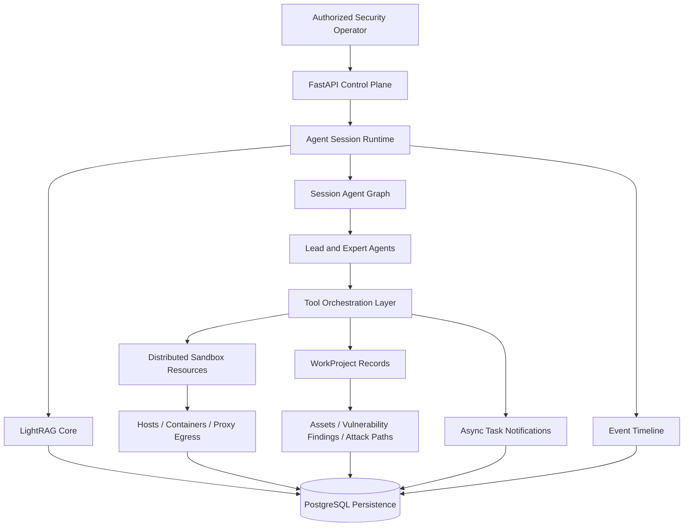
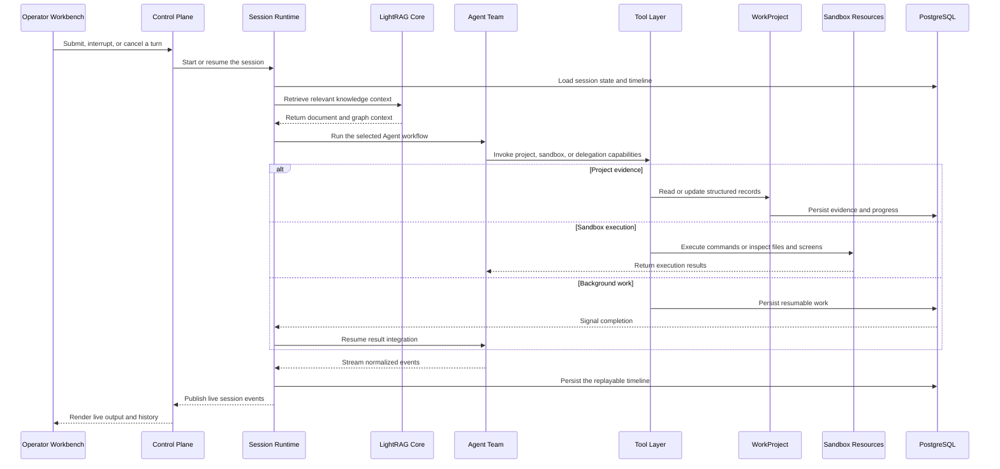

# Overview

Z3r0 is an open-source red team collaboration workbench built around specialist Agent collaboration for authorized penetration testing, vulnerability discovery, code auditing, and security research.

The platform follows a professional red team operating model. A lead Agent coordinates specialist Agents for intelligence gathering, penetration testing, code auditing, reverse analysis, and cryptanalysis. As work progresses, assets, relationships, vulnerability findings, and attack paths are captured as structured evidence, making the security workflow observable, auditable, and reproducible.

> :warning: Security Notice
>
> This project is intended only for security testing, risk assessment, and academic research within legal and explicitly authorized scopes. It must not be used for unlawful, unauthorized, or destructive purposes, including but not limited to unauthorized intrusion into computer systems or theft of others' data.
>
> This project does not grant permission to test, access, scan, or affect any third-party systems, networks, services, accounts, or data.
>
> **The author is not responsible for any consequences, losses, damages, legal liabilities, or unlawful behavior caused by users.**

## Core Capabilities

| Capability | Description |
| --- | --- |
| Multi-Agent orchestration | A lead Agent coordinates specialist Agents for intelligence gathering, validation, code audit, reverse analysis, and cryptanalysis. |
| Project evidence plane | WorkProject turns transient investigation output into persistent records, graph relationships, paths, tasks, and summaries. |
| Retrieval context plane | Building knowledge graphs with LightRAG Core provides matching original document chunks and graph context for task-oriented inputs. |
| Replayable event timeline | The UI consumes normalized timeline events that can be streamed live or loaded later as history. |
| Distributed sandbox resources | Managed Docker hosts, images, and containers allow execution environments to be isolated, scaled, and assigned to projects. |
| Preloaded sandbox toolchain | The default sandbox image bundles recon, DNS, web discovery, credential testing, Android, firmware, reverse engineering, browser, Python, and wordlist capabilities behind sandbox-local skills. |
| Unified egress layer | Container traffic can be routed through direct, HTTP, HTTPS, or SOCKS5 modes using one platform-managed policy surface. |
| Operator workbench | The frontend combines chat, project records, graph review, sandbox selector, terminal, files, and noVNC into one workflow. |

## Architecture

The architecture uses FastAPI as the control plane for sessions, projects, knowledge management, and execution resources. Agent sessions organize the lead Agent and specialist Agents through the session Agent graph. For task-oriented inputs, the session runtime retrieves semantically related context through LightRAG Core and receives matching documents, entities, and relationships before Agent execution. The tool orchestration layer connects sandbox execution, project records, asynchronous tasks, and the event timeline. Distributed sandbox resources provide isolated execution environments with browser access, file access, controlled egress, sandbox-local skills, and a preloaded security toolchain for authorized testing. WorkProject persists assets, vulnerability findings, and attack paths as traceable, reviewable project evidence. PostgreSQL stores session state, LightRAG documents, vectors, graph data, project evidence, and replayable events.

## Expert Team

| Code | Name | Role | Responsibilities |
| --- | --- | --- | --- |
| `cso` | Z3r0 | Chief Security Lead | Task decomposition, team coordination, result integration |
| `cae` | V3ra | Code Audit Engineer | Source code auditing, dependency review, remediation verification |
| `cie` | L1ly | Intelligence Gathering Engineer | Intelligence gathering, asset discovery, relationship mapping |
| `cpe` | Fr4nk | Penetration Testing Engineer | Penetration testing, vulnerability validation, impact confirmation |
| `cre` | J4m3 | Reverse Analysis Engineer | Reverse analysis, firmware disassembly, binary unpacking |
| `cce` | Nu1L | Cryptography Engineer | Cryptographic analysis, key review, security assessment |

## Runtime Sequence

