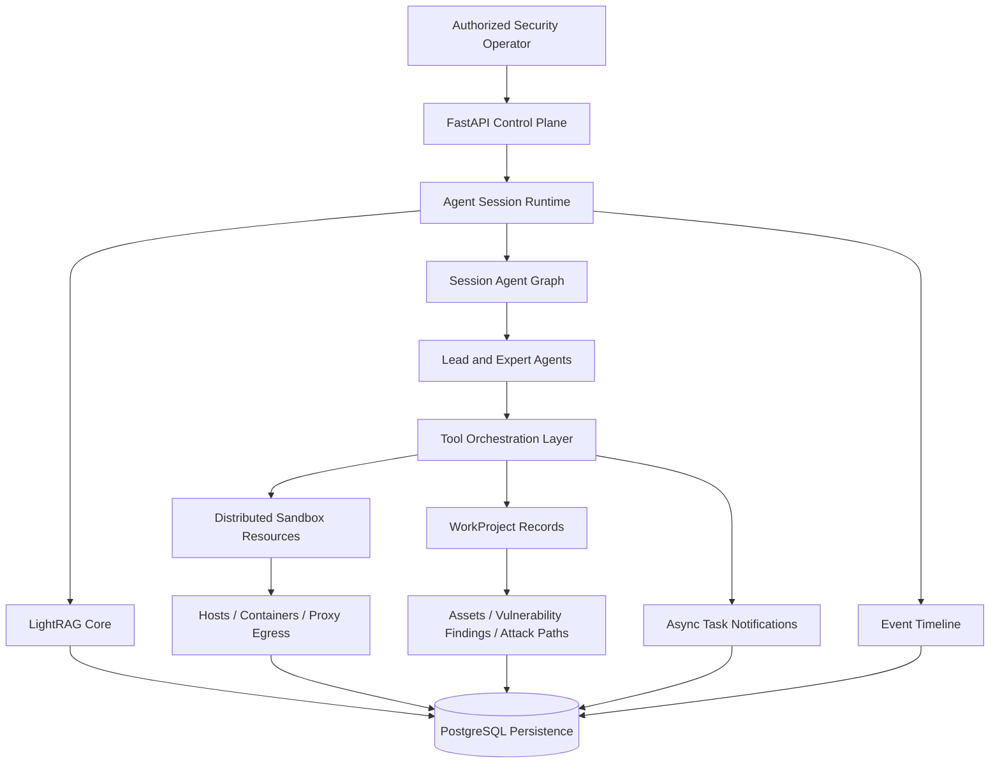
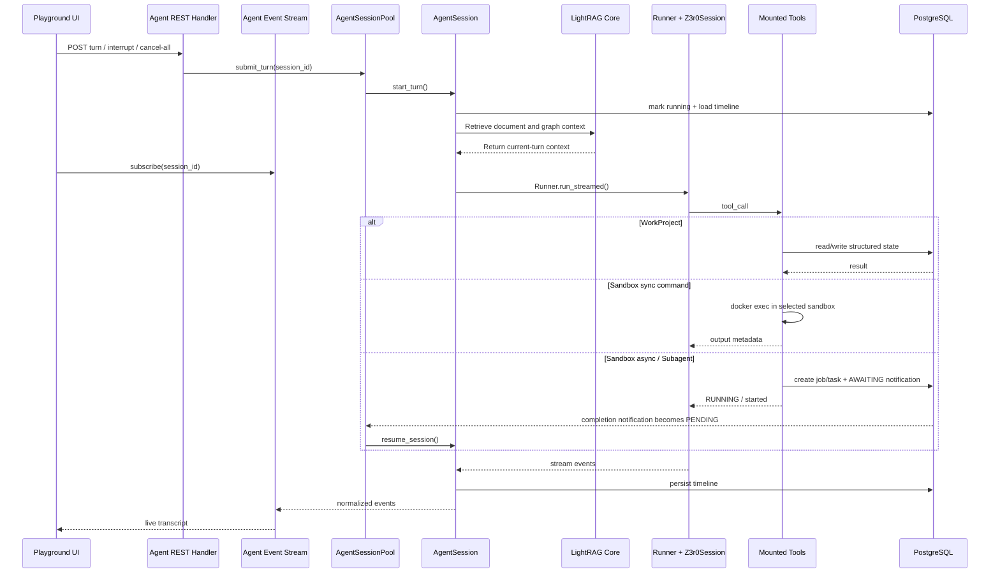

# Overview

Z3r0 is an open-source red team collaboration workbench built around specialist Agent collaboration for authorized penetration testing, vulnerability discovery, code auditing, and security research.

The platform follows a professional red team operating model. A lead Agent coordinates specialist Agents for intelligence gathering, penetration testing, code auditing, reverse analysis, and cryptanalysis. As work progresses, assets, relationships, vulnerability findings, and attack paths are captured as structured evidence, making the security workflow observable, auditable, and reproducible.

> :warning: Security Notice
>
> This project is intended only for security testing, risk assessment, and academic research within legal and explicitly authorized scopes. It must not be used for unlawful, unauthorized, or destructive purposes, including but not limited to unauthorized intrusion into computer systems or theft of others' data.
>
> This project does not grant permission to test, access, scan, or affect any third-party systems, networks, services, accounts, or data.
>
> **The author is not responsible for any consequences, losses, damages, legal liabilities, or unlawful behavior caused by users.**

## Core Capabilities

| Capability | Description |
| --- | --- |
| Multi-Agent red team orchestration | The lead Agent coordinates specialist Agents to break down intelligence, vulnerabilities, analysis, and path planning into tasks that can run in parallel. |
| Session-level runtime architecture | Each session maintains its own Agent collaboration state and supports interruption, cancellation, recovery, and continuous execution. |
| Background subagent tasks | Subagents can run as persistent background tasks and resume the parent Agent for result integration and follow-up planning. |
| Asynchronous sandbox task system | Long-running commands continue in the background with persisted state, completion updates, and session resumption. |
| Controlled sandbox execution environment | Skill loading, command execution, output reading, browser/noVNC review, and file access are wrapped in the sandbox boundary for isolated execution and traceable results. |
| Preloaded sandbox security toolchain | The default sandbox image bundles recon, DNS, HTTP probing, web discovery, credential testing, Android, firmware, reverse engineering, pwn, browser, Python, and wordlist capabilities behind sandbox-local skills. |
| Distributed test management | Multiple hosts, images, and containers are managed to support parallel testing, environment isolation, and resource scheduling. |
| Proxy egress environment isolation | Sandbox containers can bind HTTP, HTTPS, and SOCKS5 proxy egress to reduce exposure of the operator environment. |
| Project-oriented red team workflow | WorkProject centralizes assets, vulnerability findings, relationship graphs, and attack paths so the process remains traceable and reviewable. |
| Replayable event timeline | Conversations, tool calls, subtasks, errors, and result events are continuously recorded for real-time display and historical replay. |
| Knowledge administration and retrieval | LightRAG Core ingests Markdown/PDF documents, exposes document, vector, and graph views, and supplies relevant context for task-oriented inputs. |

## Architecture

The architecture uses FastAPI as the control plane for sessions, projects, knowledge management, and execution resources. Agent sessions organize the lead Agent and specialist Agents through the session Agent graph. For task-oriented inputs, LightRAG Core retrieves matching context from PostgreSQL-backed document vectors and graph relationships before Agent execution. The tool orchestration layer connects sandbox execution, project records, asynchronous tasks, and the event timeline. Distributed sandbox resources provide isolated execution environments with browser access, file access, controlled egress, sandbox-local skills, and a preloaded security toolchain for authorized testing. WorkProject persists assets, vulnerability findings, and attack paths as traceable, reviewable project evidence. PostgreSQL stores session state, LightRAG documents, vectors, graph data, project evidence, and replayable events.

## Expert Team

| Code | Name | Role | Responsibilities |
| --- | --- | --- | --- |
| `cso` | Z3r0 | Chief Security Lead | Task decomposition, team coordination, result integration |
| `cae` | V3ra | Code Audit Engineer | Source code auditing, dependency review, remediation verification |
| `cie` | L1ly | Intelligence Gathering Engineer | Intelligence gathering, asset discovery, relationship mapping |
| `cpe` | Fr4nk | Penetration Testing Engineer | Penetration testing, vulnerability validation, impact confirmation |
| `cre` | J4m3 | Reverse Analysis Engineer | Reverse analysis, firmware disassembly, binary unpacking |
| `cce` | Nu1L | Cryptography Engineer | Cryptographic analysis, key review, security assessment |

## Runtime Sequence

