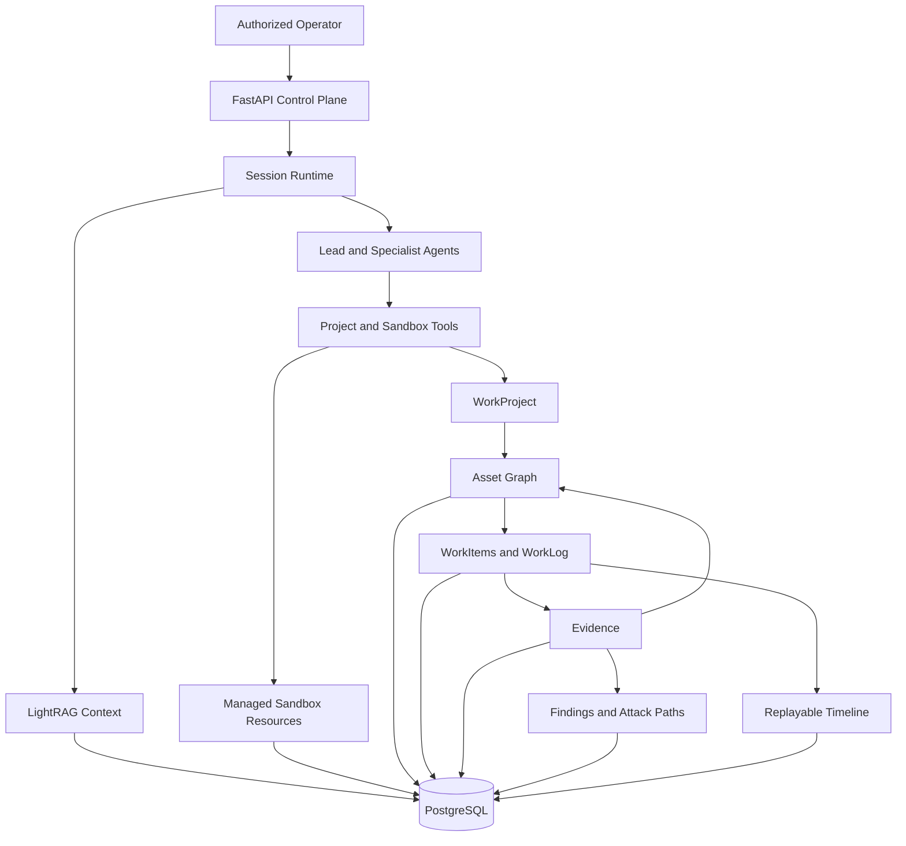
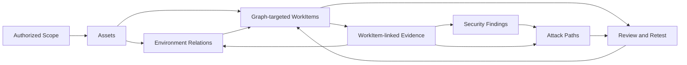
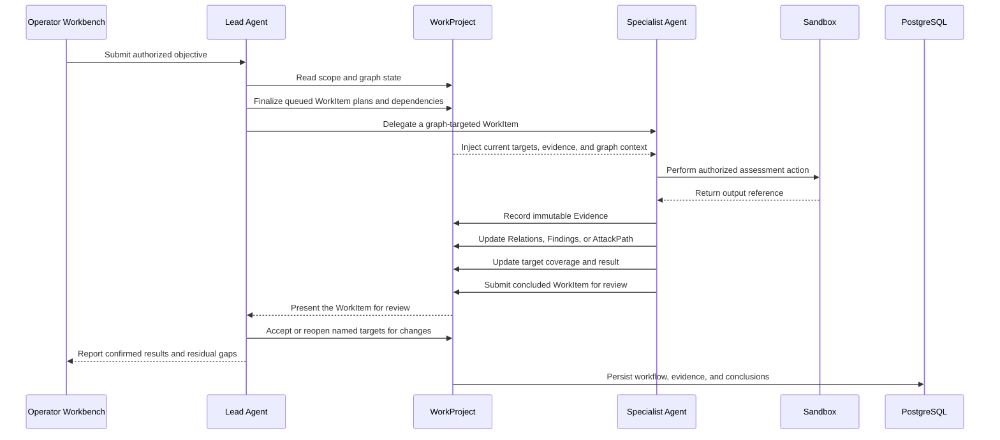

# Overview

Z3r0 is an open-source red team collaboration workbench for authorized penetration testing, vulnerability research, code auditing, reverse engineering, cryptographic review, and controlled security research.

The platform follows a specialist operating model: a lead Agent governs scope, decomposes graph-targeted WorkItems, coordinates specialist Agents, reviews evidence-backed outputs, and closes the engagement. The project record remains useful beyond the conversation because scope, environment relationships, workflow decisions, evidence, findings, and attack paths are retained as explicit application data.

> :warning: Security Notice
>
> This project is intended only for security testing, risk assessment, and academic research within legal and explicitly authorized scopes. It must not be used for unlawful, unauthorized, or destructive purposes.
>
> This project does not grant permission to test, access, scan, or affect third-party systems, networks, services, accounts, or data.
>
> **The author is not responsible for consequences, losses, damages, legal liabilities, or unlawful behavior caused by users.**

## Core Capabilities

| Capability | Description |
| --- | --- |
| Multi-Agent orchestration | A lead Agent assigns WorkItems to intelligence, penetration, code audit, reverse engineering, and cryptography specialists. |
| Graph-driven workflow | Each WorkItem identifies in-scope assets, test surfaces, dependencies, completion criteria, and an optional relation, finding, or attack-path focus. |
| Durable evidence chain | Immutable Evidence references command output, HTTP exchanges, code locations, artifacts, external sources, and useful negative results. |
| Findings and attack paths | Findings separate validation from disposition; attack paths retain continuous, evidence-backed steps from entry to target. |
| Replayable runtime | Normalized session events support live streaming, interruption, long-running work, recovery, and historical replay. |
| Controlled execution | Managed Docker sandboxes provide shell, files, browser/noVNC, skills, preloaded tooling, and container-level egress policy. |
| Retrieval context | LightRAG provides matching source chunks and knowledge-graph context for task-oriented inputs. |
| Operator workbench | Overview, Workflow, Graph, Assets, Findings, Attack Paths, Evidence, and Activity views support professional review. |

## Architecture

The control plane manages identities, projects, sessions, knowledge collections, execution resources, and outbound policy. Specialists receive assigned WorkItems together with the relevant project and graph context. The evidence plane distinguishes environment facts from offensive actions: Relations describe structure, connectivity, dependencies, identity, trust, data flow, and provenance; AttackPath steps describe exploitation and movement. PostgreSQL retains the shared operating record and session timeline.

## WorkProject Model

Assets give the team a stable inventory of in-scope, contextual, and out-of-scope entities. WorkItems turn the graph into coordinated assignments by connecting specialists, target assets, test surfaces, dependencies, and review outcomes. Each specialist receives the current project context needed for its assignment, while Evidence keeps observations attributable and traceable to source material. Findings bring together validation, impact, remediation, CWE/CVSS, and affected assets; attack paths reconstruct demonstrated offensive progression with optional ATT&CK mappings.

## Runtime Sequence

New assets, credentials, trust relationships, code paths, versions, keys, and routes surface relevant retest opportunities. The workbench keeps blocked assignments, deferred or suspected Findings, and open path hypotheses visible alongside the surrounding graph and evidence, helping operators understand what changed and where follow-up work is most valuable. Search and structured filters provide direct access to the relevant workflow, asset, Finding, and Evidence records during review.

## Expert Team

| Code | Name | Role | Responsibilities |
| --- | --- | --- | --- |
| `cso` | Z3r0 | Chief Security Lead | Scope governance, WorkItem planning, coordination, review, and closure |
| `cae` | V3ra | Code Audit Engineer | Source review, dependency analysis, vulnerability tracing, and remediation review |
| `cie` | L1ly | Intelligence Engineer | Asset discovery, ownership correlation, exposure analysis, and relationship mapping |
| `cpe` | Fr4nk | Penetration Engineer | Live testing, vulnerability validation, attack progression, and impact confirmation |
| `cre` | J4m3 | Reverse Engineer | Binary, firmware, mobile, protocol, and artifact analysis |
| `cce` | Nu1L | Cryptography Engineer | Protocol, primitive, certificate, token, and key-management review |
