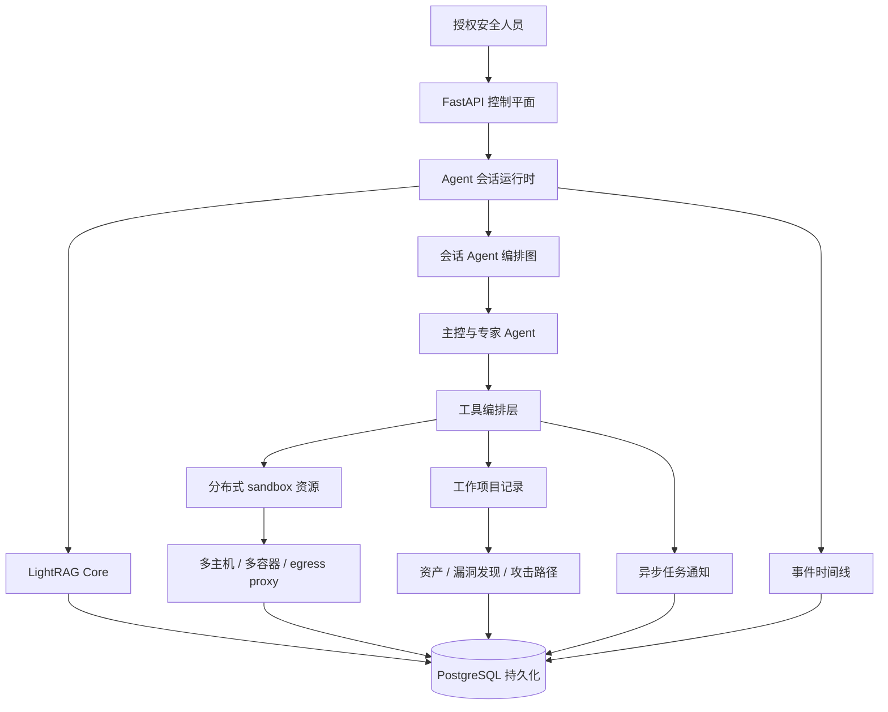
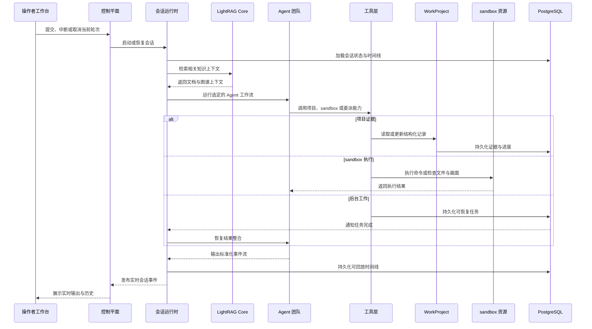

# 概览

Z3r0 是一个开源的红队协作工作台，围绕多专家 Agent 协同构建，面向授权渗透测试、漏洞挖掘、代码审计和安全研究等专业场景。

平台采用红队专业分工模型，由主控 Agent 协调情报侦察、渗透测试、代码审计、逆向分析和密码分析等专家 Agent。任务执行过程中，系统持续沉淀资产、关系、漏洞发现和攻击路径，形成可长期留存的结构化证据，使安全工作具备可观察性、可审计性和可复现性。

> :warning: 安全声明
> 
> 本项目仅限在合法且获得明确授权的范围内用于安全测试、风险评估和学术研究，严禁用于任何违法、未授权或具有破坏性的用途，包括但不限于非法入侵计算机系统、窃取他人数据等行为。
> 
> 本项目不授予任何测试、访问、扫描或影响第三方系统、网络、服务、账号或数据的权限。
> 
> **作者不对使用者造成的任何后果、损失、损害、法律责任或违法行为负责。**

## 核心能力

| 能力 | 说明 |
| --- | --- |
| 多 Agent 编排 | 主控 Agent 协调情报搜集、漏洞验证、代码审计、逆向分析和密码分析专家。 |
| 项目证据平面 | WorkProject 将临时分析输出转化为持久记录、关系图、攻击路径、任务和摘要。 |
| 检索上下文平面 | 通过 LightRAG Core 构建知识图谱，为任务型输入提供匹配的原始文档分块与图谱上下文。 |
| 可回放事件时间线 | 前端消费标准化时间线事件，同一模型支持实时流和历史回放。 |
| 分布式 sandbox 资源 | 托管 Docker 主机、镜像和容器使执行环境可以隔离、扩展并绑定到项目。 |
| 预装 sandbox 工具链 | 默认 sandbox 镜像围绕 sandbox 内 skills 提供侦察、DNS、Web 发现、凭据测试、Android、固件、逆向、浏览器、Python 和字典能力。 |
| 统一出口层 | 容器流量可通过直连、HTTP、HTTPS 或 SOCKS5 模式路由，并由平台统一管理策略。 |
| 操作者工作台 | 前端将对话、项目记录、图谱复核、sandbox 选择、终端、文件和 noVNC 组织为统一流程。 |

## 项目架构

该架构以 FastAPI 作为控制平面，统一管理会话、项目、Knowledges 和执行资源。Agent 会话通过编排图组织主控 Agent 与专家 Agent。处理任务型输入时，会话运行时通过 LightRAG Core 检索语义关联上下文，并在 Agent 执行前获得匹配的文档、实体和关系。工具编排层连接 sandbox 执行、项目记录、异步任务和事件时间线。分布式 sandbox 资源为授权安全测试提供隔离执行环境；WorkProject 将资产、漏洞发现和攻击路径沉淀为可追踪、可复盘的项目证据。PostgreSQL 统一持久化会话状态、LightRAG 文档、向量、图谱数据、项目证据和回放事件。

## 专家团队

| 代码 | 名称 | 角色 | 职责 |
| --- | --- | --- | --- |
| `cso` | Z3r0 | 首席安全负责人 | 任务拆解、团队协调、结果整合 |
| `cae` | V3ra | 代码审计工程师 | 源码审计、依赖审查、修复复核 |
| `cie` | L1ly | 情报搜集工程师 | 情报搜集、资产发现、关系映射 |
| `cpe` | Fr4nk | 渗透测试工程师 | 渗透测试、漏洞验证、影响确认 |
| `cre` | J4m3 | 逆向分析工程师 | 逆向分析、固件拆解、程序解包 |
| `cce` | Nu1L | 密码分析工程师 | 密码分析、密钥审查、安全评估 |

## 运行时序

