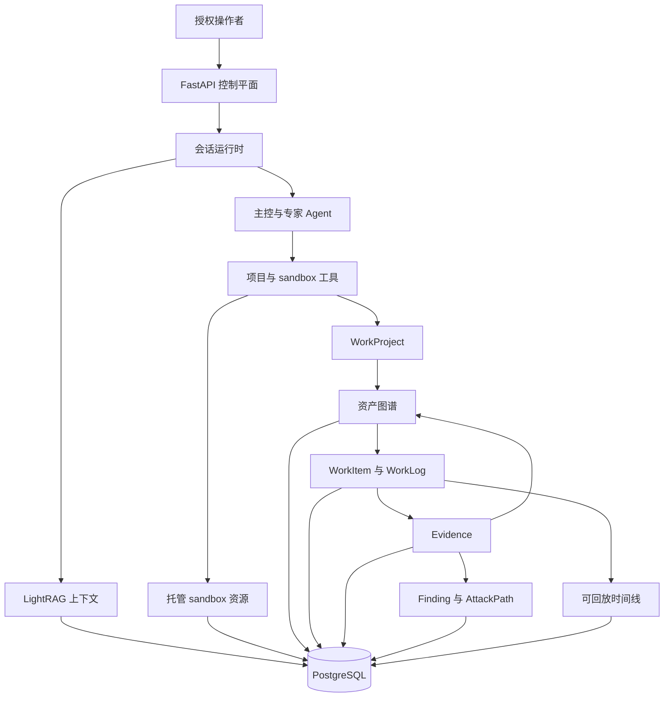
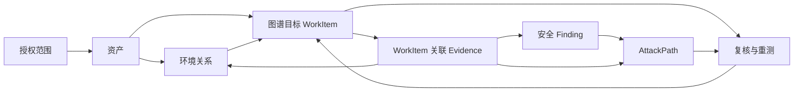
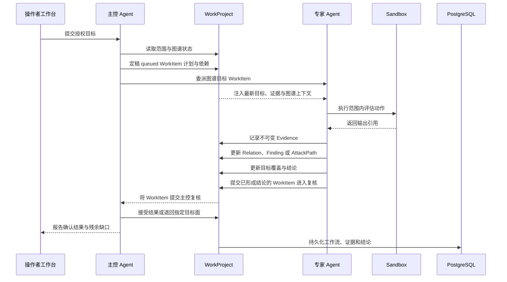

# 概览

Z3r0 是面向授权渗透测试、漏洞研究、代码审计、逆向分析、密码评估和受控安全研究的开源红队协作工作台。

平台采用专业分工模型：主控 Agent 治理范围、拆解图谱目标 WorkItem、协调专家 Agent、复核证据支持的产出并完成项目结项。项目记录不依赖对话存续，授权范围、环境关系、工作流决策、证据、漏洞发现和攻击路径均作为显式应用数据长期保留。

> :warning: 安全声明
>
> 本项目仅限在合法且获得明确授权的范围内用于安全测试、风险评估和学术研究，严禁用于违法、未授权或破坏性用途。
>
> 本项目不授予测试、访问、扫描或影响任何第三方系统、网络、服务、账号或数据的权限。
>
> **作者不对使用者造成的后果、损失、损害、法律责任或违法行为负责。**

## 核心能力

| 能力 | 说明 |
| --- | --- |
| 多 Agent 编排 | 主控 Agent 将 WorkItem 分配给情报、渗透、代码审计、逆向和密码分析专家。 |
| 图谱驱动工作流 | 每个 WorkItem 明确范围内资产、测试面、依赖、完成标准和可选关系、发现或攻击路径焦点。 |
| 持久证据链 | 不可变 Evidence 引用命令输出、HTTP 交换、代码位置、制品、外部来源和有效负面结果。 |
| 发现与攻击路径 | Finding 分离验证与处置状态；AttackPath 保存从入口到目标的连续、证据支持步骤。 |
| 可回放运行时 | 标准化会话事件支持实时输出、中断、长周期作业、恢复和历史回放。 |
| 受控执行环境 | 托管 Docker sandbox 提供 Shell、文件、浏览器/noVNC、skills、预装工具和容器级 egress 策略。 |
| 检索上下文 | LightRAG 为任务型输入提供匹配的原始文档分块与知识图谱上下文。 |
| 操作者工作台 | Overview、Workflow、Graph、Assets、Findings、Attack Paths、Evidence 和 Activity 支持专业复核。 |

## 项目架构

控制平面统一管理身份、项目、会话、知识集合、执行资源和出口策略。专家会收到分配的 WorkItem 及其相关项目和图谱上下文。证据平面区分环境事实与攻击动作：Relation 描述结构、连接、依赖、身份、信任、数据流和来源；AttackPathStep 描述利用与推进。PostgreSQL 保存共享作业记录和会话时间线。

## WorkProject 模型

Asset 为团队提供稳定的范围内、上下文和范围外实体清单。WorkItem 将资产图谱转化为可协作的专家分工，关联目标资产、测试面、依赖和复核结果。每位专家都能获得完成当前分工所需的最新项目上下文，Evidence 则让观察事实保持清晰归属并可追溯到原始材料。Finding 汇总验证状态、影响、修复建议、CWE/CVSS 和受影响资产；AttackPath 通过可选 ATT&CK 映射还原已经得到验证的攻击推进。

## 运行时序

新资产、凭据、信任关系、代码路径、版本、密钥和路由会呈现相关重测机会。工作台将受阻分工、deferred 或 suspected Finding、待验证路径假设与周边图谱和证据一并呈现，帮助操作者理解变化并判断最有价值的跟进方向。搜索与结构化筛选可在复核过程中直接定位相关工作流、资产、Finding 和 Evidence 记录。

## 专家团队

| 代码 | 名称 | 角色 | 职责 |
| --- | --- | --- | --- |
| `cso` | Z3r0 | 首席安全负责人 | 范围治理、WorkItem 规划、协调、复核与结项 |
| `cae` | V3ra | 代码审计工程师 | 源码审查、依赖分析、漏洞追踪与修复复核 |
| `cie` | L1ly | 情报工程师 | 资产发现、归属关联、暴露面分析与关系映射 |
| `cpe` | Fr4nk | 渗透测试工程师 | 在线测试、漏洞验证、攻击推进与影响确认 |
| `cre` | J4m3 | 逆向分析工程师 | 二进制、固件、移动端、协议与制品分析 |
| `cce` | Nu1L | 密码分析工程师 | 协议、算法、证书、令牌与密钥管理评估 |
