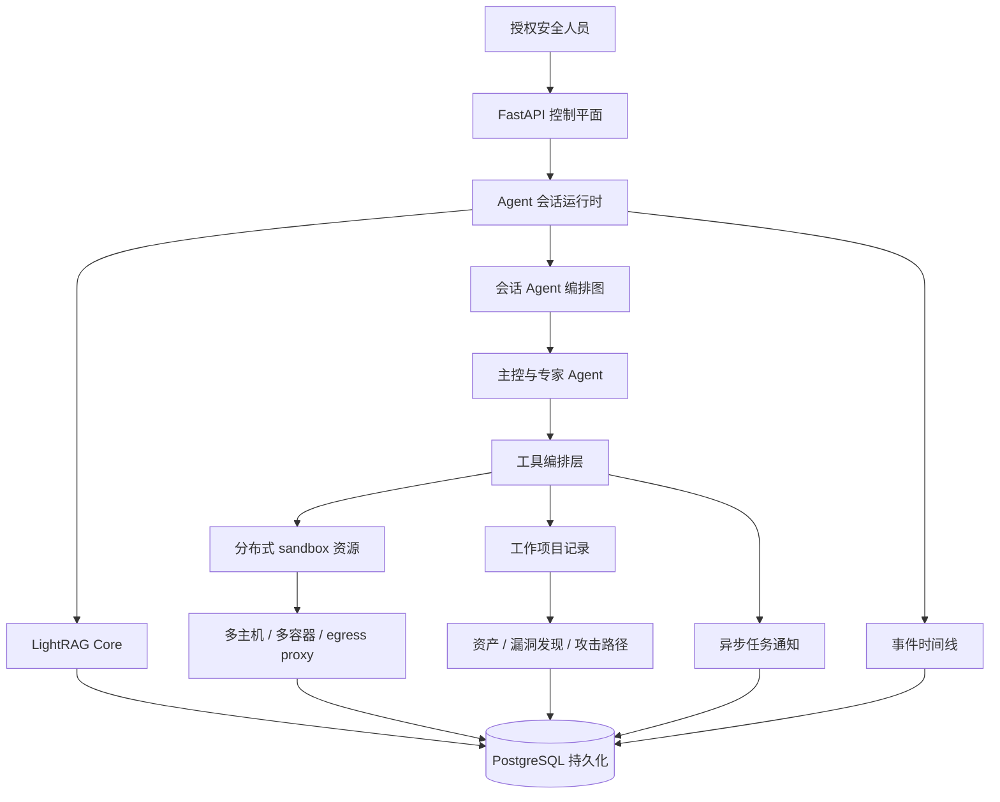
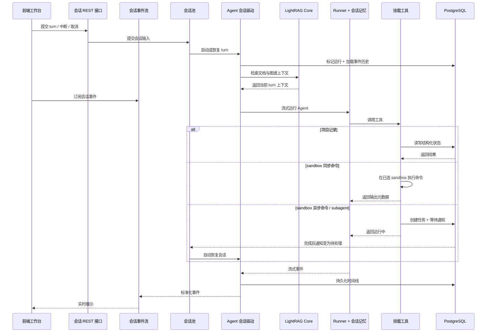

# 概览

Z3r0 是一个开源的红队协作工作台，围绕多专家 Agent 协同构建，面向授权渗透测试、漏洞挖掘、代码审计和安全研究等专业场景。

平台采用红队专业分工模型，由主控 Agent 协调情报侦察、渗透测试、代码审计、逆向分析和密码分析等专家 Agent。任务执行过程中，系统持续沉淀资产、关系、漏洞发现和攻击路径，形成可长期留存的结构化证据，使安全工作具备可观察性、可审计性和可复现性。

> :warning: 安全声明
> 
> 本项目仅限在合法且获得明确授权的范围内用于安全测试、风险评估和学术研究，严禁用于任何违法、未授权或具有破坏性的用途，包括但不限于非法入侵计算机系统、窃取他人数据等行为。
> 
> 本项目不授予任何测试、访问、扫描或影响第三方系统、网络、服务、账号或数据的权限。
> 
> **作者不对使用者造成的任何后果、损失、损害、法律责任或违法行为负责。**

## 核心能力

| 能力 | 说明 |
| --- | --- |
| 多 Agent 红队编排 | 由主控 Agent 协调专家 Agent，将情报、漏洞、分析和路径梳理拆解为可并行推进的任务。 |
| 会话级运行时架构 | 每个会话维护独立的 Agent 协作状态，支持中断、取消、恢复与连续执行。 |
| 后台 subagent 任务 | subagent 可作为后台任务持久运行，并在完成后恢复父 Agent 进行结果整合和后续规划。 |
| 异步 sandbox 任务系统 | 长时间运行的命令可在后台持续执行，并保留状态、完成通知与会话恢复能力。 |
| 受控 sandbox 执行环境 | skills 加载、命令执行、输出读取、浏览器/noVNC 复核和文件访问都收束在 sandbox 边界内，兼顾隔离执行和结果追踪。 |
| 预装 sandbox 安全工具链 | 默认 sandbox 镜像围绕 sandbox 内 skills 提供侦察、DNS、HTTP 探测、Web 发现、凭据测试、Android、固件、逆向、pwn、浏览器、Python 和字典能力。 |
| 分布式测试管理器 | 支持多主机、多镜像和多容器管理，为并行测试、环境隔离和资源调度提供基础设施。 |
| egress 环境隔离 | sandbox 容器可绑定 HTTP、HTTPS 和 SOCKS5 proxy，降低操作者环境暴露风险。 |
| 项目化红队工作流 | 通过 WorkProject 统一管理资产、漏洞发现、关系图谱和攻击路径，使过程更易追踪和审查。 |
| 可回放事件时间线 | 持续记录对话、工具调用、子任务、错误和结果事件，支持实时展示与历史回放。 |
| 知识管理与检索 | LightRAG Core 接入 Markdown/PDF 文档，提供文档、向量与图谱视图，并为任务型输入检索相关上下文。 |

## 项目架构

该架构以 FastAPI 作为控制平面，统一管理会话、项目、Knowledges 和执行资源。Agent 会话通过编排图组织主控 Agent 与专家 Agent。处理任务型输入时，LightRAG Core 会在 Agent 执行前从 PostgreSQL 中的文档向量与图谱关系检索匹配上下文。工具编排层连接 sandbox 执行、项目记录、异步任务和事件时间线。分布式 sandbox 资源为授权安全测试提供隔离执行环境；WorkProject 将资产、漏洞发现和攻击路径沉淀为可追踪、可复盘的项目证据。PostgreSQL 统一持久化会话状态、LightRAG 文档、向量、图谱数据、项目证据和回放事件。

## 专家团队

| 代码 | 名称 | 角色 | 职责 |
| --- | --- | --- | --- |
| `cso` | Z3r0 | 首席安全负责人 | 任务拆解、团队协调、结果整合 |
| `cae` | V3ra | 代码审计工程师 | 源码审计、依赖审查、修复复核 |
| `cie` | L1ly | 情报搜集工程师 | 情报搜集、资产发现、关系映射 |
| `cpe` | Fr4nk | 渗透测试工程师 | 渗透测试、漏洞验证、影响确认 |
| `cre` | J4m3 | 逆向分析工程师 | 逆向分析、固件拆解、程序解包 |
| `cce` | Nu1L | 密码分析工程师 | 密码分析、密钥审查、安全评估 |

## 运行时序

